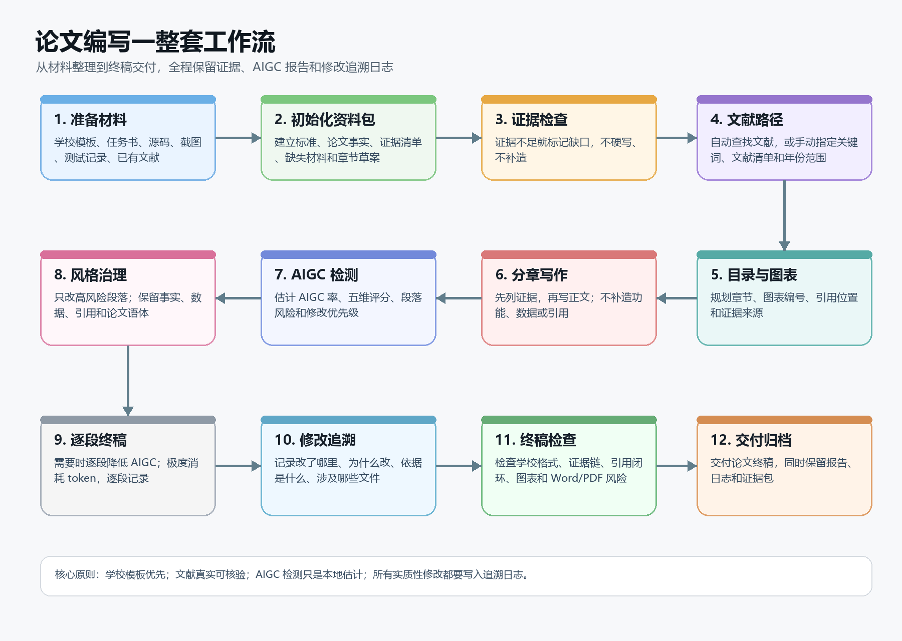

# Thesis Standardizer Skill

这是一个给 Claude Code / Codex 使用的本科论文标准化 skill。用户不需要自己记命令，直接用自然语言让 AI 安装、初始化、检测、改写和记录日志即可。

它不要求从 0 开始写论文。已经有开题报告、任务书、论文初稿、章节草稿、Word 批注、AIGC 报告、参考文献清单或专项修改任务时，也可以直接让它接着整理、检查和修改。

## 推荐模型

优先推荐：

- Claude Opus
- Codex

其他模型只推荐：

- Qwen

## 最简单的安装方式

把这个仓库链接发给 Claude Code 或 Codex，然后直接说：

> 帮我安装这个仓库里的 `thesis-standardizer` skill，安装好后告诉我怎么使用。

如果你已经把仓库下载到本地，就说：

> 这是我本地的 thesis skills 项目，请帮我安装或更新里面的 `thesis-standardizer` skill。

安装完成后，重新打开一个会话，直接说你要做什么即可。

## 一整套工作流

## 怎么使用

### 生成论文资料包

> 用 `thesis-standardizer` 帮我初始化论文资料包。请先读取我的学校模板、任务书、源码、截图、测试材料和已有文献，不要急着写正文，先整理标准、事实、证据、缺失材料、图表计划和章节目录。

### 处理已有论文或专项修改

> 用 `thesis-standardizer` 接着处理我已有的论文初稿。请先读取现有正文、导师意见、AIGC 报告和参考文献清单，整理需要修改的位置，不要从 0 重写。

> 用 `thesis-standardizer` 只处理这个专项任务：降低 AIGC 风格并补充修改日志。其他章节不要动。

### 从程序源码整理毕业论文

> 用 `thesis-standardizer` 根据我的项目源码生成论文证据包。请整理真实技术栈、模块结构、数据库线索、接口线索、测试证据和可以写进论文的功能点，证据不足的地方标记出来。

### 查找和整理参考文献

自动查找可以这样说：

> 用 `thesis-standardizer` 根据我的论文题目和摘要自动规划文献检索。请优先找近 6 年真实可核验的中文和英文文献，不要编造参考文献，找不到就告诉我缺口。

手动指定也可以这样说：

> 用 `thesis-standardizer` 按我给的关键词、年份范围、数据库要求和文献清单来整理参考文献。请核验文献信息，建立正文引用和文末参考文献的对应关系。

### 写某一章正文

> 用 `thesis-standardizer` 写第 4 章。请先列出本章证据，再写正文。只使用已有源码、截图、测试、数据和文献，不要补造功能、实验或引用。

### 检测文本 AIGC 率

> 用 `thesis-standardizer` 检测这份论文草稿的 AIGC 率。请输出本地启发式估计、五维评分、段落风险和修改优先级，并明确说明这不是学校或第三方平台的官方检测分数。

### 降低 AIGC 风格

> 用 `thesis-standardizer` 先生成 AIGC 风格风险报告，再只修改 high 和 medium 风险段落。请保留事实、数据、引用和论文语体，模糊归因标记 `needs_source`，证据不足标记 `needs_evidence`。

### 做最终逐段降低版

> 用 `thesis-standardizer` 对整篇论文执行 AIGC 最终降低版。请先提醒我这个流程会按段落逐段处理，极度消耗 token；然后逐段改写、逐段记录事实保留和证据缺口，最后拼接全文并检查段间衔接。

### 处理 Word 批注

> 用 `thesis-standardizer` 读取导师在 Word 里的批注，逐条生成修改任务。能直接改的就改，需要补材料的地方标记 `needs_evidence` 或 `needs_source`，并把每条处理结果写入修改日志。

### 记录修改日志

> 用 `thesis-standardizer` 为刚才的论文修改补充追溯日志。请记录改动位置、修改前摘要、修改后摘要、为什么改、依据是什么、涉及哪些文件、是否还有证据或来源缺口。

### 终稿检查

> 用 `thesis-standardizer` 做终稿审查。重点检查学校格式、章节结构、证据链、参考文献闭环、图表编号、AIGC 风格、修改日志和 Word/PDF 排版风险。

## 使用原则

- 学校模板和导师要求优先。
- 不编造功能、接口、数据、测试结果、参考文献或 DOI。
- AIGC 检测结果只是本地启发式估计，不是官方检测分数。
- AIGC 降低的目标是让论文更具体、更自然、更有证据，不是承诺绕过检测器。
- 每次实质性修改都要有日志，方便追溯“改了哪里、为什么改、依据是什么”。
- 文献、引用、作者、年份、DOI、期刊信息和学校格式要求最好由你自己最终核实正确与否。

## 免责声明

该 skill 只用于辅助开发、资料整理、论文规范检查和写作修改建议。请尊重学术成果和学校学术规范，不可全权用于论文开发或替代作者本人的研究、判断、核实和写作责任。

## 一句话开始

> 用 `thesis-standardizer` 帮我把这个毕业设计项目整理成一套可写论文的资料包，先不要写正文，先检查标准、证据、文献、AIGC 风险和缺失材料。
